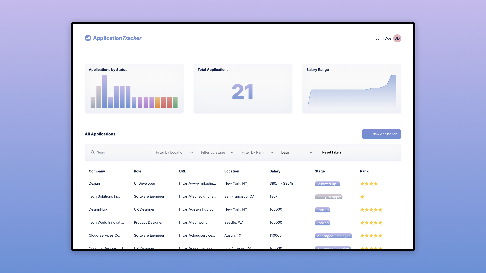

# Application Tracker

https://applicationtrackerapp.org/



A MERN stack application for tracking and managing job applications.

## Table of Contents

- [Application Tracker](#application-tracker)
  - [Table of Contents](#table-of-contents)
  - [Installation](#installation)
  - [Usage](#usage)
  - [Production](#production)
  - [Testing](#testing)
  - [Technologies Used](#technologies-used)
  - [License](#license)

## Installation

1. Clone the repository:
   ```bash
   git clone https://github.com/yourusername/application-tracker.git
   cd application-tracker
   ```

2. Install dependencies for the server and client:
   ```bash
   cd server
   npm install
   cd ../client
   npm install
   ```

3. Create a `.env` file in the `server` directory (and the same one in the `/` directory for production) and add the following environment variables:
   ```plaintext
   MONGO_URI=
   JWT_SECRET=
   PORT=
   CLIENT_ORIGIN=
   COOKIES_SECRET=
   CSRF_SECRET=
   SESSION_SECRET=
   ```

4. Update a `.env.development` and `.env.production` file in the `client` directory and add the following environment variables:
   ```plaintext
   HOST=
   PORT=
   REACT_APP_SERVER_URL=
   ```

5. Start the development servers:
   ```bash
   # In the server directory
   npm start

   # In the client directory
   npm start
   ```

## Usage

- Open your browser and navigate to `http://localhost:PORT` to access the application.

## Production

In the `/` directory, (make sure `./client/.env.production` and `./.env` are configured correctly)

   ```bash
   npm install

   npm run build

   npm run serve
   # or
   pm2 start .ecosystem.config.js
   ```

## Testing

Run tests using Jest and Supertest:
   ```bash
   # In the server directory
   npm start

   # In the client directory
   npm start
   ```

## Technologies Used

- **Frontend**: React, Typescript, SCSS Modules
- **Backend**: Node.js, Express, MongoDB, Mongoose
- **Authentication / Security**: JWT, csrf-csrf
- **Testing**: Jest, Supertest
- **State Management**: React-Redux

## License

This project is licensed under the MIT License.